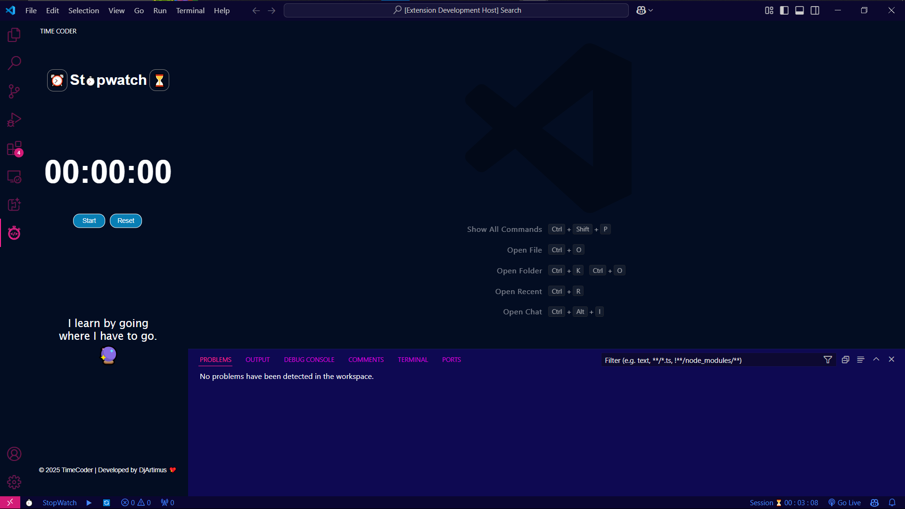
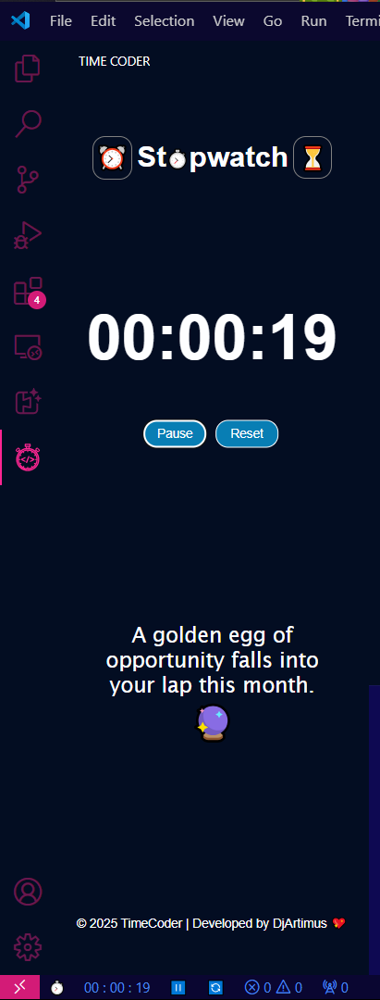

# Time Coder - VS Code Extension

## Overview
Time Coder is a Visual Studio Code extension designed to help developers track their time efficiently using a **Stopwatch** and a **Pomodoro Timer**. This extension provides an intuitive way to measure time spent on tasks, track sessions, and improve productivity with various features.

  

## Features
- **Stopwatch Mode** ⏱: Measure elapsed time with a start, pause, and reset function.
- **Pomodoro Timer Mode** ⏰: Focus on tasks using the Pomodoro technique with customizable durations.
- **Session Tracking** 📊: Records session history to help analyze time spent on coding.
- **Status Bar Integration** 📌: Displays real-time time tracking updates directly in the status bar.
- **Webview Panel Support** 🌐: Provides an interactive UI for managing timers.
- **Sidebar Panel** 📂: Access Stopwatch and Pomodoro timers through a dedicated sidebar UI.
- **Shortcut Commands** 🚀: Easily control the timers with VS Code commands.

---

### 🏆 Fortune Message Feature

- Fortune Messages: Before starting a task, users are greeted with a random motivational or insightful message in the sidebar, enhancing focus and positivity.

  

- Enhanced User Experience: Helps users start their work with a positive mindset and motivation.
- Dynamic Display: The message updates regularly, adding an engaging element to time management

## Installation

1. Open **Visual Studio Code**.
2. Navigate to the **Extensions Marketplace** (`Ctrl + Shift + X` or `Cmd + Shift + X` on macOS).
3. Search for `Time Coder`.
4. Click **Install** and reload VS Code if necessary.

---

## Usage

### Start the Stopwatch
1. Click on the **Stopwatch** button in the status bar or sidebar.
2. Click ▶ to start, ⏸ to pause, and 🔄 to reset.
3. Time updates will be shown in the status bar and sidebar.

### Start the Pomodoro Timer
1. Click on the **Pomodoro** button in the status bar or sidebar.
2. Click ▶ to start, ⏸ to pause, and 🔄 to reset.
3. Adjust the timer using ⏬ (Decrease) and ⏫ (Increase).
4. When the timer completes, an alert will notify you.

### Switch Between Modes
- Click on the **Clock Emojis** in the status bar or sidebar ( ⏰/⏱/⏳ ) to toggle between Session Timer, Stopwatch and Pomodoro.

---

## Sidebar UI
The extension includes a dedicated **Sidebar Panel** for enhanced usability. The sidebar consists of:
- **Timer Display**: Shows the current time for Stopwatch, Pomodoro, and Session tracker.
- **Control Buttons**: Start, pause, reset, increase, and decrease time options.
- **Mode Toggle**: Easily switch between Session Tracker, Stopwatch, and Pomodoro directly from the sidebar.
- **Session History**: View past sessions for tracking productivity.

  

---

## Commands
| Command | Description |
|---------|-------------|
| `timeCoder.toggleMode` | Switch between Stopwatch and Pomodoro mode |
| `timeCoder.toggleTimer` | Start or pause the current timer |
| `timeCoder.resetTimer` | Reset the active timer |
| `timeCoder.adjustPomodoroTimeIncrease` | Increase Pomodoro duration |
| `timeCoder.adjustPomodoroTimeDecrease` | Decrease Pomodoro duration |
| `timeCoder.openWebview` | Open the detailed time tracking dashboard |

You can access these commands via **Command Palette (`Ctrl + Shift + P` or `Cmd + Shift + P`)**.

---

## Contributing
We welcome contributions! Feel free to submit issues, feature requests, or pull requests to improve the extension.

1. Fork the repository.
2. Create a new branch.
3. Make changes and commit.
4. Submit a pull request.

---

## License
This project is licensed under the MIT License - see the [LICENSE](./licence) file for details.

---

## Credits
👨‍💻 Developed by **DjArtimus**. 

## Connect with Me 🚀

[GitHub](https://github.com/Dj-Artimus) |
[LinkedIn](https://linkedin.com/in/pratikpansare) |
[Portfolio](https://pratik-dj-artimus.vercel.app/) |
[Twitter](https://x.com/Dj_Artimus?t=0HK49JZRYxEmeqWiD5M9yQ&s=09)
